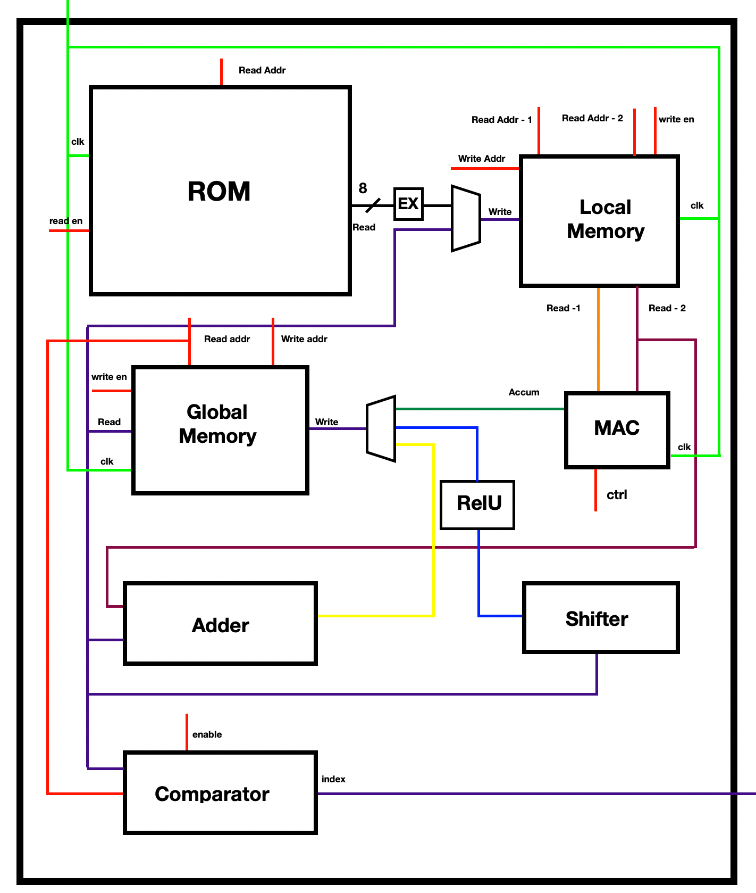
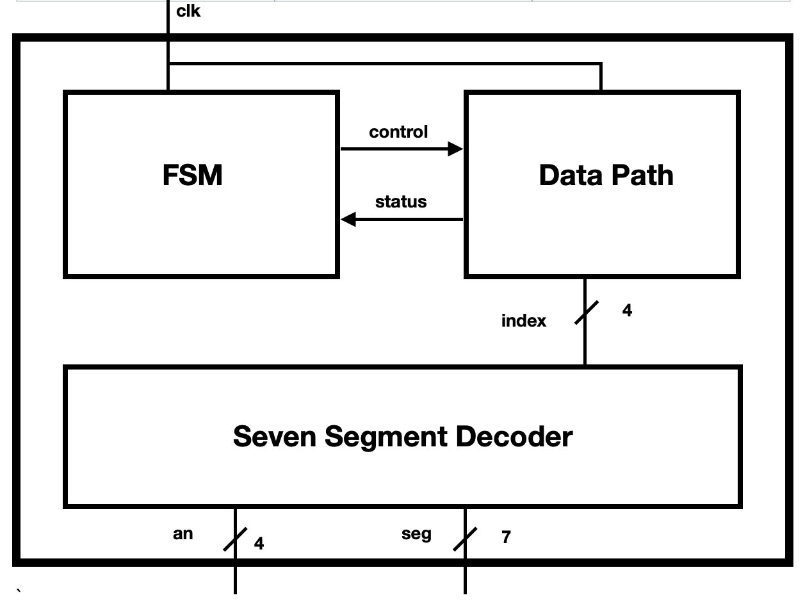

# Assignment 2- Part 2 
## Report

### Somaditya Singh | Entry No.  2020CS10389

#### Ujjwal Mehta | Entry No.  2020CS10401

### Overview 

In this final part of the assignment we created the control path and datapath to connect all the modules created in part 1 of this assignment in order to obtain a working neural network to classify the digit corresponding to its `mif` file and display the predicted digit on the FPGA board using the seven segment decoder from the previous assignment.

## Memory Layout 
#### ROM 
This stores the entire image data as well as the weight and the bias matrices. It has one clocked read port, which is controlled by an `enable` signal.

#### Local Memory
This has two read ports and one write port that is controlled by an `enable` signal. The read outputs from this memory are inputs to the MAC as well as to the bias adder. The write input to this memory is multiplexed from ROM and global memory.

#### Global Memory
This makes use of one read port and one write port, that is controlled by an `enable` signal. It stores the intermediate layer as well as the finally computed layer. The activations are transferred from the the Global Memory back to the Local Memory after computation of the first layer. Note that adding bias, shifting, and applying `RelU` are all done by reading from the Global Memory itself. 

## Control Path (FSM) 

The corresponding code for the FSM of our neural network can be found in fsm.vhd file and the use of this  FSM is to coordinate between the weights reading from ROM, the layer value computation using MAC, the bias adding, writing and reading activation values in RAM and finally storing the maximum value index corresponding to the final layer.  The port entity mapping for our FSM is shown below :

```
entity fsm is
    Port (
        clk : in std_logic;
        state : inout integer := 0;

        write_addr_ram : out unsigned(11 downto 0);
        write_enable_ram : out std_logic := '0';
        read_act_addr_ram : out unsigned(11 downto 0);
        read_weight_addr_ram : out unsigned(11 downto 0) := x"000";

        write_addr_local : out unsigned(11 downto 0);
        write_enable_local : out std_logic := '0';
        read_act_addr_local : out unsigned(11 downto 0);
        read_weight_addr_local : out unsigned(11 downto 0);

        read_enable_rom : out std_logic := '0';
        addr_rom : out unsigned(15 downto 0);

        mac_ctrl : out std_logic := '0';

        comparator_enable : out std_logic := '0'
    );
end fsm;
```

 Here in our FSM we will output the ROM reading address, RAM write and read address, local memory write and read address (note that we are using another component of RAM as our local memory and 1 component as the global memory) as well as the mac control signals which will decide whether the layer value computation is started or is already going on. We also output the comparator enable which will get active when we need to compare in the final layer. Now we will describe the states of our FSM :

- State 0 : This state is the initial image and weight loading state and in this we will load the data from mif files in our ROM, once done loading we move to state 1
- State 1 : This state involves loading image data values in our local memory and then after loading we move to state 2
- State 2 : This state involves loading the weights from ROM to our local memory then we move to state 3
- State 3 : This state involves the image data and weight column multiplication the result of which is stored in global memory and we jump between state 2 and state 3 untill all the values of hidden layer are computed and stored in global memory, finally we jump to state 4 
- State 4 : This state involves loading bias values for hidden layer in local memory then we jump to state 10
- State 10 : This state involves updating the global memory with bias value addition then we jump to state 12
- State 12 : This state involves shifting the hidden layer values and updating in the global memory then we go to state 5
- State 5 : This state involves loading the activation values from layer 1(stored in global memory) into the local memory then we go to state 6
- State 6 : This state involves loading weights in local memory for the final layer computation then we go state 7 after all the weights are loaded 
- State 7 : This state involves vector multiplication of layer 1 activation values with the loaded weights and we jump between state 6 and state 7 until all the values of final layer are computed and stored in global memory and then we go to state 8
- State 8 : This state involves loading the bias for final layer into  local memory then we go state 11 once this is done to update the values with bias addition then state 13 for shifting them and finally we go to state 9
- State 9 : This state involves computing the overall maximum value digit from our final shifted layer values 


## Datapath

The components used in the datapath are the same as the ones that were described in part 1 of this assignment. 
The only change is in the `comparator` entity which was earlier designed to only find the maximum value but not the index at which it occurs. Finding the index was achieved by adding two additional ports to the `comparator`.
The `seven segment` entity has been used from the previous assignment.

The `Adder`,  `Shifter`, `EX`, and `RelU` entities are all implicitly defined in the datapath as concurrent assignments statements.

Below is the datapath for our design. Every bus transfers 16 bits unless mentioned otherwise. The control signals from the FSM have been marked in RED. 



## NeuralNetwork Entity
This entity combines the FSM, Datapath and the Seven Segement Decoder to obtain the overall Neural Network, in the following manner.


